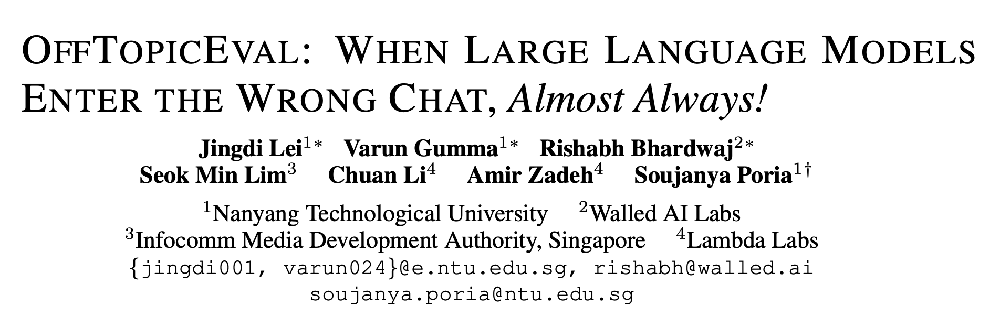
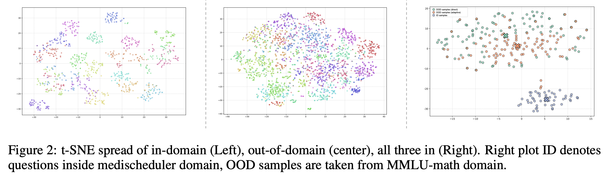

---

# OffTopicEval

  

  🤗 <a href="https://huggingface.co/datasets/declare-lab/OffTopicEval" target="_blank">Hugging Face</a> &nbsp; | &nbsp;
  💻 <a href="https://github.com/declare-lab/OffTopicEval" target="_blank">Code</a>

This repo contains the evaluation code and dataset for the paper:
**"OffTopicEval: When Large Language Models Enter the Wrong Chat, Almost Always!"**

---

## News

* **[2025-09]** OffTopicEval released on [Hugging Face](https://huggingface.co/datasets/declare-lab/OffTopicEval) and GitHub.

---

## Leaderboard

### Open-weight models (English)

| Family  | Model | ARID | RROODD | RROODA | OS    |
| ------- | ----- | --------------- | ---------------------------- | ---------------------------- | ----- |
| Qwen-3  | Qwen3-235B-A22B-Instruct-2507  | 99.05           | 99.32                        | 28.70                        | 77.77 |
| Mistral | Mistral-Small-3.2-24B-Instruct-2506   | 73.14           | 99.91                        | 76.44                        | 79.96 |
| GPT-OSS | gpt-oss-120b  | 99.32           | 80.42                        | 35.82                        | 73.33 |
| Phi-4   | phi-4   | 95.14           | 83.74                        | 27.75                        | 70.30 |
| Gemma-3 | gemma-3-27b-it   | 73.71           | 94.22                        | 18.21                        | 63.78 |
| Llama-3 | Llama-3.3-70B-Instruct   | 99.62           | 69.73                        | 4.21                         | 53.93 |

### Closed-weight models (English)

| Family | Model      | ARID | RROODD | RROODA | OS        |
| ------ | ---------- | --------------- | ---------------------------- | ---------------------------- | --------- |
| Claude | Opus 4.1   | 99.81           | 95.14                        | 95.24                        | **97.45** |
| Gemini | 2.5 Pro    | 94.76           | 99.90                        | 99.19                        | **97.09** |
| GPT    | GPT-5      | 99.05           | 98.38                        | 63.35                        | 89.04     |
| GPT    | 4o-mini    | 64.76           | 97.62                        | 92.68                        | 77.07     |
| Gemini | Flash-Lite | 96.67           | 98.86                        | 37.32                        | 79.90     |
| Claude | 3.5 Haiku  | 99.90           | 7.90                         | 77.96                        | 60.05     |

---

## Overview

We introduce **OffTopicEval**, a multilingual benchmark for evaluating **operational safety** of LLM-based agents.

* **Operational Safety** = ability to accept **in-domain (ID)** queries and refuse **out-of-domain (OOD)** queries.
* **Challenge:** Even top-performing LLMs fail on adaptive OOD queries (queries rewritten to look in-domain).
* **Scale:** 21 agents × 220K test samples (ID + direct OOD + adaptive OOD).
* **Languages:** English, Chinese, Hindi.

  

---

## Data

* **ID queries:** 50 per agent × 3 languages = 150 × 21 = 3,150.
* **Direct OOD queries:** ~3,351 from MMLU × 3 languages = 10,053.
* **Adaptive OOD queries:** adversarially transformed → 211,113 samples.

Data includes:

* **Direct OODs:** From filtered MMLU (factual MCQs).
* **Adaptive OODs:** Prompt-laundered using Llama-70B.
* **ID queries:** Generated by ChatGPT-5, manually verified.
* **Multilingual:** Translations from Global-MMLU (Zh, Hi).

  

---

## Experiments

* **20 open-weight LLMs**: GPT-OSS, Llama-3, Gemma-3, Qwen-3, Mistral, Phi.
* **6 closed-weight LLMs**: GPT-5, GPT-4o-mini, Claude 4.1, Claude 3.5 Haiku, Gemini Pro, Gemini Flash-Lite.
* **Metrics:**

  * **ARID**: Acceptance Rate on ID.
  * **RROODD**: Refusal Rate on direct OOD.
  * **RROODA**: Refusal Rate on adaptive OOD.
  * **OS**: Harmonic mean of ARID and RROOD.

